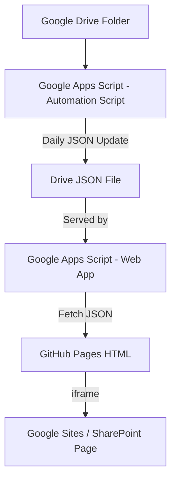

# Software Downloads Portal

This project provides a lightweight, filterable download interface for ANSYS software and installation files, hosted on GitHub Pages and backed by a JSON file served via Google Apps Script from Google Drive.

---

## 🌐 Live Architecture Overview

---

## 🔧 Components

### 1. **Google Drive**
- Hosts the actual ANSYS software files and folders.
- A JSON file (`ansys_data.json`) is also stored here and updated daily.

### 2. **Google Apps Script**
- **Automation Script**: Runs daily (or manually) to scan Drive and generate the latest JSON file.
- **Web App Script**: Serves the JSON with CORS headers to allow access from GitHub Pages.

### 3. **GitHub Pages**
- Hosts the front-end HTML (`index.html`) that:
  - Fetches the JSON
  - Displays a searchable and filterable table by `Version` and `OS`
  - Provides download links to files hosted in Drive

### 4. **Google sites / SharePoint**
- Embeds the GitHub Pages site in an iframe
- Acts as the public-facing user interface

---

## 📁 Files Included

- `index.html`: Front-end HTML with filters, error handling, and table layout
- `README.md`: This file
- `ansys_data.json`: Automatically generated (not in repo, but served via Apps Script)

---

## 🚀 Getting Started

1. **Fork or clone this repo**
2. **Upload `index.html` to GitHub Pages**
3. **Set up two Apps Script Projects**:
   - One for automation and Drive scanning
   - One for serving JSON (using `doGet()` and publishing as a Web App)
4. **Embed the GitHub page inside your SharePoint iframe**
5. ✅ Done — fully automated download portal with filters!

---

## 📌 Future Enhancements

- ✅ Download count tracking via Google Sheets
- ✅ Add versioning support to JSON
- ✅ File size display
- ✅ Responsive design and mobile UI improvements

---

## 🔐 Security Notes

- JSON serving web app must be **public** (`Anyone` access)
- Files in Drive must be shared publicly (or use Google Workspace domain-level controls)

---

## 💬 Support

Feel free to open an issue or reach out if you need enhancements like download tracking or full SharePoint integration.

